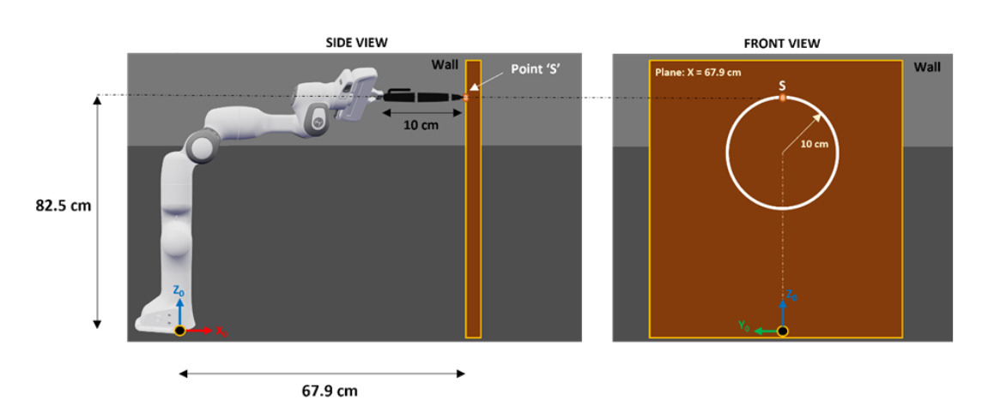
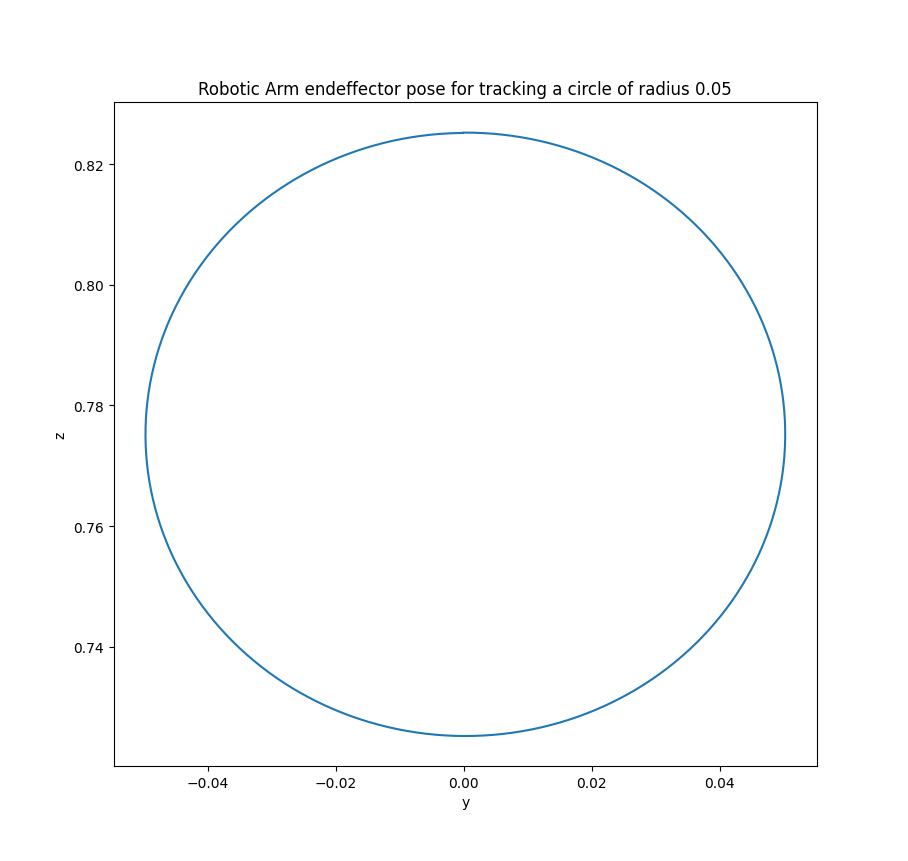
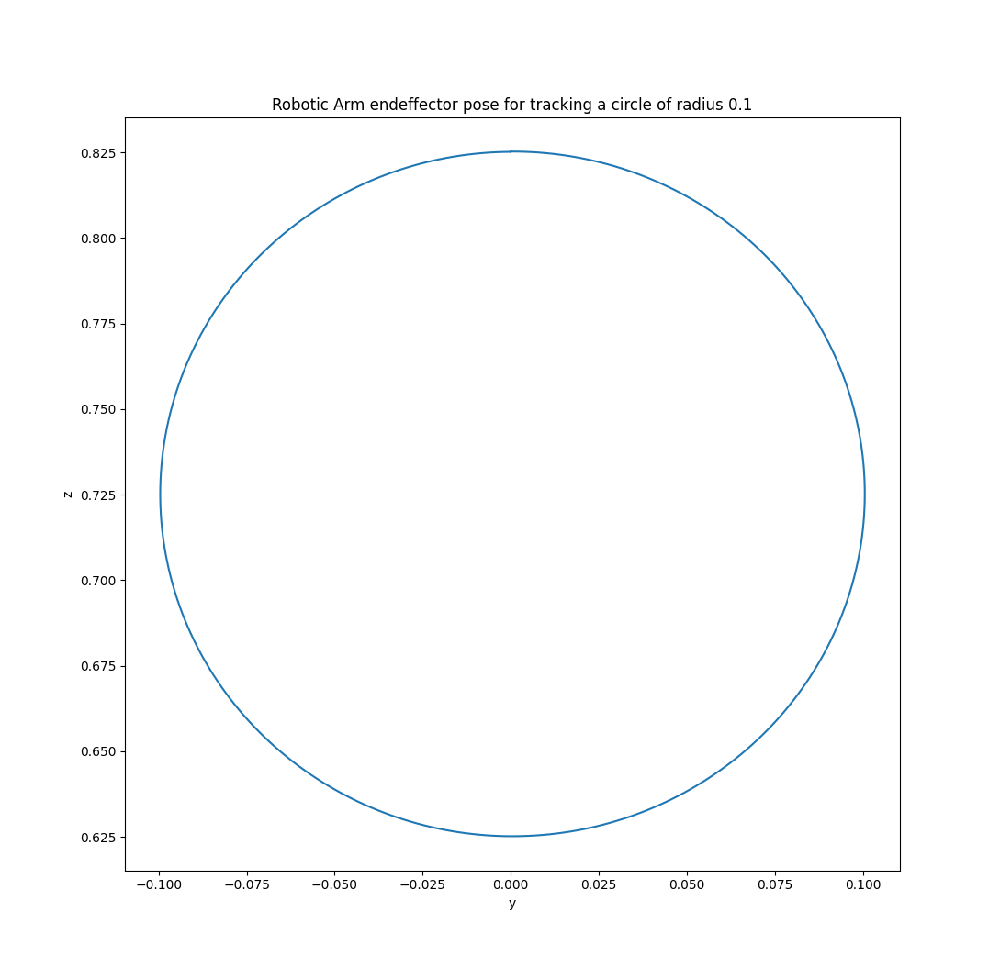
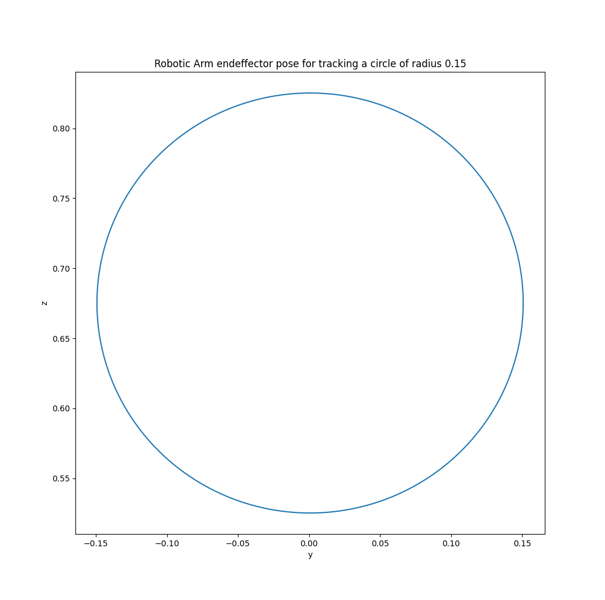

# Manipulator_Motion_Planner_IK_Solver

# Team Members:

- Krishna Hundekari

- Tej Kiran
  
- Abrarudin Syed

# Project Overview:

## Introduction
The Manipulator Arm Path Planner is crucial for the robot's efficiency and versatility. It allows the
robot to plan and execute precise arm movements, opening up opportunities for a wide range of
applications. The module ensures that the robot can interact with its environment, objects, and other
components with precision. This is particularly valuable in industries such as manufacturing,
healthcare, and logistics, where precise manipulation is vital.

## Purpose
The Purpose of this project is to develop a C++ software library with Inverse Kinematic solver for the
motion planning of a Robotic Manipulator ARM for Acme Robotics. The library computes inverse
velocity kinematics, that is joint angles, based on the end effector velocities.
This software module can be used for the motion planning (IK solver) of any n-degrees of freedom
manipulator.

## Algorithm
We are using the DH parameter technique to solve the Inverse Kinematics problem of a manipulator.
At each instant the algorithm computes the Jacobian of end effector velocities w.r.t to joint angles.
Then inverse inverse of this Jacobian matrix is used to compute joint angles from the end effector
velocities using the below formula

  JointVelocities = J-1 * EndEffectorVelocities

We have decided to demonstrate the solution by plotting the end effector location using computed
joint angles for the given trajectory.

## Technologies and Libraries
The module will be developed using the following technologies:
- Programming Language: C++11/14
- Libraries: Eigen, Matplotlibcpp
- Build System: CMake
- Testing Framework: Google Test
- Static Code Analysis: cppcheck

## Project Assumptions
The following assumptions are made for developing the project:
- The robotic arm is assumed to be a standard serial manipulator.
- The velocity trajectory of the end effector is known in advance
- The speed of computation depends on the systems being used for computation. The module
does not provide any algorithms to compute inverse position kinematics.


## Verification Setup

## We have taken the following example setup for verifying our iksolver using the demo app and designing our test cases




## Results

We are passing the velocity profile of the endeffector as the input to the IK solver. Out test cases involve end effector motions in the XY plane at certain Z height, and for the purpose of ease of representation we are going to trace circles of three different radii.

### The end effector trajectory for tracking a circle of radius 0.05 m



### The end effector trajectory for tracking a circle of radius 0.1 m


### The end effector trajectory for tracking a circle of radius 0.15 m



# C++ Boilerplate v2 Badges
 [](https://codecov.io/gh/KrishnaH96/Manipulator_Motion_Planner_IK_Solver)


# [Link for the AIP Log Sheet](https://docs.google.com/spreadsheets/d/13-OB5Zy51qPaeGvC6LTy-5HckD2iuU5O/edit?usp=sharing&ouid=116812388978309632579&rtpof=true&sd=true)


## Proposal Video:

### [Link for the video](https://drive.google.com/file/d/11OWSdmg63_YWRikv8_3u8mmxUu3mqiwZ/view?usp=drive_link)


## API and Other Developer Documnetation


### How to build
``` bash
# Cloning the repository
  git clone --recurse-submodules <repo-link>
# Configure the project and generate a native build system:
  # Must re-run this command whenever any CMakeLists.txt file has been changed.
  cmake -S ./ -B build/
# Compile and build the project:
  # rebuild only files that are modified since the last build
  cmake --build build/
  # or rebuild everything from scracth
  cmake --build build/ --clean-first
  # to see verbose output, do:
  cmake --build build/ --verbose
# Clean and start over:
  rm -rf build/
#
```
### How to run the demo
```bash
# To demo executable is named "app" which can be run using the command
./build/app/app
```

### How to run tests
```bash
# To run the tests for the ik solver
cd build/; ctest; cd -
```

### How togenerate doxygen documentation
```bash
# Go into the the doxygen directory
cd doc 
# Run the doxygen command
doxygen
```

## Steps to geneate code coverage report
```bash
# if you don't have gcovr or lcov installed, do:
  sudo apt-get install gcovr lcov
# Set the build type to Debug and WANT_COVERAGE=ON
  cmake -D WANT_COVERAGE=ON -D CMAKE_BUILD_TYPE=Debug -S ./ -B build/
# Now, do a clean compile, run unit test, and generate the coverage report
  cmake --build build/ --clean-first --target all test_coverage
# open a web browser to browse the test coverage report
  open build/test_coverage/index.html
## Steps to install eigen library
```


## Install eigen library
```bash
# Install eigen library
sudo apt install libeigen3-dev

# Install numpy library
pip3 install numpy
```


## Known issue
### Issue with CppCheck and eigen library << operator initialization.
Cppcheck complains about the ',' based eigen matrix and vector initialization.

Bug:
```
warning: Found suspicious operator ',' [constStatement] 

for

initializations such as : " config << 0, 0, 0, -3.14/2, 0, 3.14, 0; "
```


ReF: https://sourceforge.net/p/cppcheck/discussion/development/thread/1b66df674f/

### cpplint and the order of Eigen header

Eigen header shows error if it is placed at the beginning of the CPP file, but cpplint is detecting the eigen file as c header file and raising a warning that it needs to be placed at beginning.


